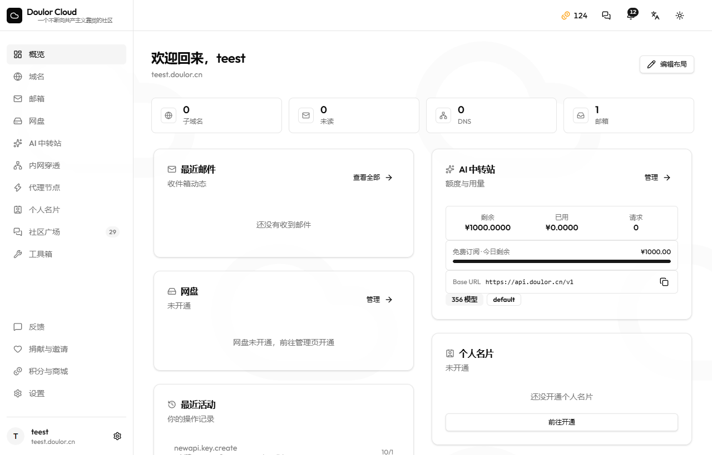
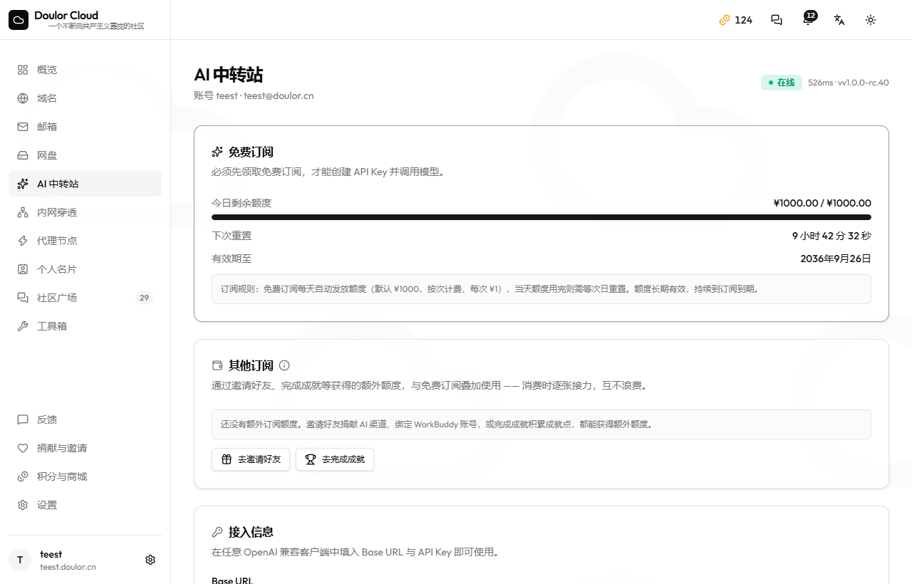
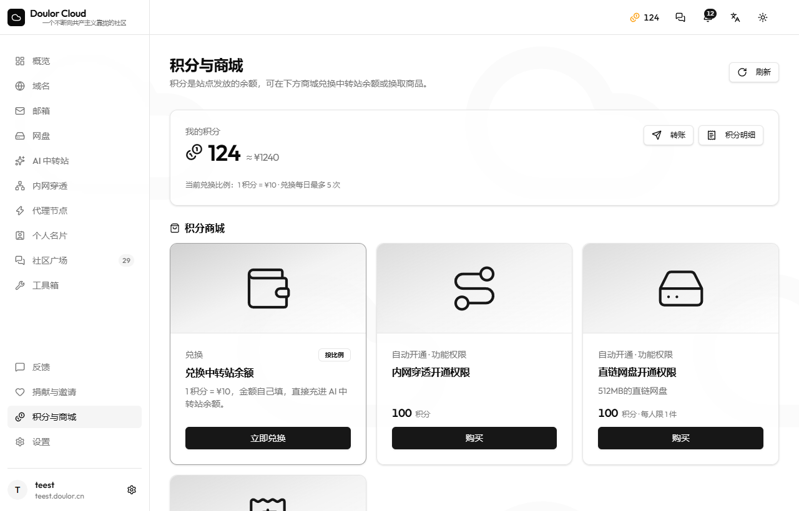
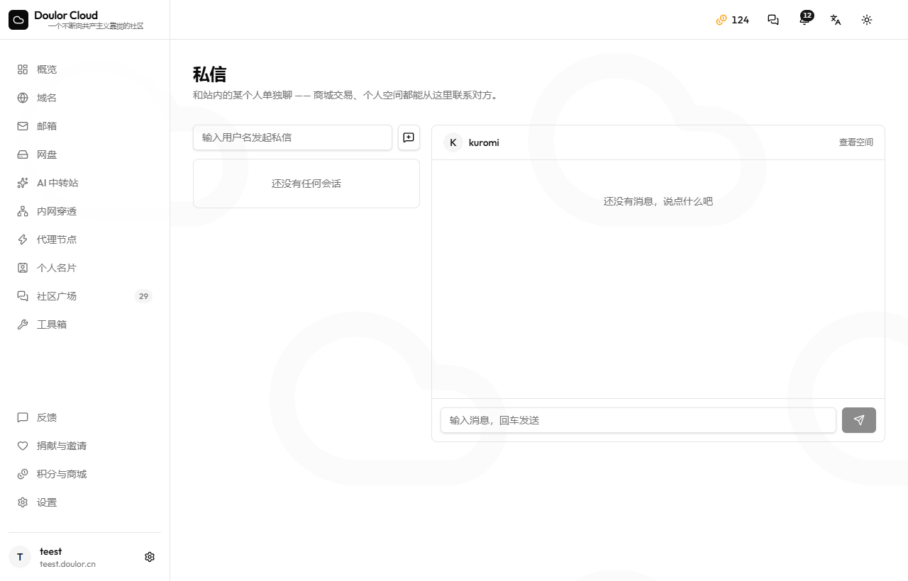

<div align="center">


# Doulor Cloud

**一站式云端资源分发平台** —— 二级域名、域名邮箱、直链网盘、个人名片（Bento 空间）与 AI API 中转站

[cloud.doulor.cn](https://cloud.doulor.cn)
·
[](https://github.com/Doulor/DoulorCloud) Doulor/DoulorCloud

纯静态前端 + Serverless 后端：前端是构建产物直出的 SPA，后端全部跑在 Cloudflare Workers 上，数据库用 D1（SQLite）、对象存储用 R2，不依赖任何常驻服务器。

</div>

---

## 目录

- [界面预览](#界面预览)
- [功能概览](#功能概览)
- [架构](#架构)
- [技术栈](#技术栈)
- [目录结构](#目录结构)
- [核心设计](#核心设计)
- [数据模型](#数据模型)
- [安全模型](#安全模型)
- [本地开发](#本地开发)
- [发展历程](#发展历程)
- [Star History](#star-history)
- [许可](#许可)

---

## 界面预览

| 控制台 | AI 中转站 |
| :---: | :---: |
|  |  |

| 积分与商城 | 私信 |
| :---: | :---: |
|  |  |

> 截图来自线上实例（[cloud.doulor.cn](https://cloud.doulor.cn)），界面为深色主题，全站中英双语可切换。

---

## 功能概览

| 模块 | 说明 |
| --- | --- |
| **账号体系** | 邀请码 / 限时开放注册、邮箱验证、会话（D1 存储 + 多 Cookie 容错）、管理员 / 站长分级、可注销 |
| **二级域名** | 用户自助申请 `*.doulor.cn` 子域名，走 Cloudflare DNS API 创建与回收；支持自定义域名的自定义记录 |
| **域名邮箱** | 基于 Cloudflare Email Routing：每个用户按用户名获得 `用户名@doulor.cn` 邮箱，支持转发规则、临时分享箱、网页端收发 |
| **直链网盘** | R2 对象存储（S3 兼容 API，跨账号），多桶架构 + 每用户配额，支持自定义直链域名与预签名直传 |
| **个人名片 / 空间** | Bento 网格个人主页（`/space/<用户名>`、`/profile/<slug>`），音乐、歌词、图库、链接卡片、自定义配色与自动缩放 |
| **社区** | 帖子 / 评论 / 图片（走 R2）、楼中楼回复、通知与邮件提醒 |
| **聊天室** | 频道式实时聊天（轮询实现，不引常驻连接）、在线状态、未读角标 |
| **AI 中转站** | 自建 NewAPI 网关的账号打通：开通、密码绑定、API Key 代建、额度同步、订阅套餐、渠道捐献自动化 |
| **捐献体系** | 用户捐献上游 AI 渠道 / 反代账号（WorkBuddy、CLI2API 等）换取权限；自动审核 + 人工兜底 |
| **积分与成就** | 注册 / 捐献 / 活动获得积分；成就点独立体系、成就徽章与自定义称号 |
| **活动与抽奖** | 活动报名（认证码 / 抽奖）、奖池分配、到点自动开奖、活动分享页 |
| **积分商城** | 官方与用户商品、5 种交付方式（自动发码 / 人工 / 订阅 / 权限 / 积分）、订单状态机与消息中心联动 |
| **内网穿透（frp）** | frp 节点申请与开通，按节点鉴权方式决定是否需账号密码 |
| **代理订阅** | 订阅链接解析、节点测速与展示 |
| **工具箱** | 20+ 纯浏览器端工具（图片压缩、格式转换、文本处理…），零服务端请求 |
| **管理面板** | 用户 / 权限 / 捐献审核 / 商品订单 / 活动 / 公告 / 邮件通道 / 站点设置 / 额度看板（Cloudflare 用量与费用估算） |

国际化：全站中英双语（自研零依赖 i18n，键值点分命名、类型安全）。

---

## 架构

```
                    ┌──────────────────────────────┐
   浏览器  ────────► │  Cloudflare 边缘（WAF / CDN） │
                    └──────────────┬───────────────┘
                                   │
        ┌──────────────────────────┼──────────────────────────┐
        ▼                          ▼                          ▼
┌────────────────┐        ┌────────────────┐        ┌──────────────────┐
│ 前端静态资产    │        │  API Worker    │        │  Email Worker    │
│ (Workers 静态  │        │ (鉴权/权限/业务 │        │ (收信路由 → 入库  │
│  资产 + SPA)   │        │  + CF API 调用) │        │  / 转发 / 回复)   │
└────────────────┘        └───────┬────────┘        └────────┬─────────┘
                                  │                          │
                 ┌────────────────┼────────────────┬─────────┘
                 ▼                ▼                ▼
           ┌──────────┐     ┌──────────┐    ┌────────────────┐
           │   D1     │     │   R2     │    │ Cloudflare API │
           │ (SQLite) │     │ (对象存储)│    │ (DNS/邮件路由)  │
           └──────────┘     └──────────┘    └────────────────┘
                 │
                 ▼
         ┌────────────────┐
         │ 外部 AI 中转站  │  ← 自建 NewAPI 网关（LLM API 聚合与分发）
         │  (NewAPI 集群) │
         └────────────────┘
```

- **前端**：Vite + React + TypeScript，构建产物由 Workers 静态资产托管（不是 Pages、不依赖 SSR）。
  带内容 hash 的产物长缓存，HTML 永不缓存（避免 SPA 部署后引用旧 chunk）。
- **API Worker**：一个 Worker 承载全部 REST 路由（`/api/*`）+ 运行时动态创建的 Worker Route
  （用户自定义域名、直链域名、名片域名）。路由表是「声明式数组 + 精确/正则匹配」，配套静态护栏脚本
  保证「路由 ↔ 实现 ↔ 导出」三者一致。
- **D1**：单库多表（70+ 张表），全部访问经 `env.DB`；读复制（read replication）开启后，
  每个请求使用 D1 Session（`first-primary`）——首查走主库保证「刚写入立即可见」，
  同请求内后续查询可被就近副本服务。
- **R2**：不用绑定，走 S3 兼容 REST API（自实现 SigV4 签名），因此可以跨 Cloudflare 账号使用；
  支持多桶、平台桶 / 用户桶分离、预签名直传与直链反代。
- **邮件**：收信走 Email Routing → Email Worker；发信是三级通道（Brevo API → 自建 Posta 队列 → Cloudflare Send Email），
  任一道额度耗尽自动降级切换。

---

## 技术栈

| 层 | 选型 |
| --- | --- |
| 前端 | Vite（Rolldown）、React、TypeScript、Tailwind CSS、Radix UI / shadcn 风格组件 |
| 后端 | Cloudflare Workers（ES Modules）、D1、R2（S3 API）、Workers 静态资产 |
| 测试 | Vitest + `@cloudflare/vitest-plugin`（miniflare 内跑真实 Worker + D1）、Playwright（真浏览器走查） |
| 质量护栏 | 自研静态检查：路由↔实现一致性、设置项是否真被服务端读取、死代码、i18n 键完整性 |
| 邮件 | Cloudflare Email Routing（收）、Brevo / Posta / Cloudflare Send Email（发） |
| AI 网关 | 自建 NewAPI（集群部署，多节点共享库） |

---

## 目录结构

```
src/                     前端
  components/            业务组件 + ui/（基础组件）
  layouts/               Landing / Dashboard 布局
  pages/                 路由页面（含管理面板各标签页）
  lib/                   工具（i18n、颜色、格式化、工具箱注册表…）
  services/api.ts        统一请求层（自动带 Cookie、错误归一化）
  types/                 共享类型
worker/                  后端（独立 npm 包）
  src/
    index.ts             路由表 + fetch/email/scheduled 三个入口
    handlers/            按业务域拆分的处理器（auth/community/chat/email/storage/newapi/…）
    auth.ts              会话与鉴权（requireUser / 权限解析）
    permissions.ts       权限模型（功能开关 + 角色）
    settings.ts          站点设置（默认值 + 读写；护栏要求每个键都有服务端读取点）
    r2.ts                R2 的 S3 / REST 两种模式与多桶分配
    newapi-client.ts     自建 AI 网关的 API 客户端（含缓存与令牌复用）
    mailer.ts            三级发信通道与模板
  migrations/            D1 迁移（按序执行）
  schema.sql             D1 基线表结构
  test/                  Vitest 用例（在 miniflare 里跑真实 Worker）
  scripts/               一致性护栏脚本（npm run check:*）
site-worker.js           前端站点的 Worker 入口（HTTPS 跳转 + 安全响应头 + 缓存策略）
```

---

## 核心设计

### 1. 单一 API Worker + 声明式路由
所有接口集中在一张路由表里声明（`kind: "exact" | "regex" | "branch"`），配合
`npm run check:handlers` 静态校验「前端调用的路径是否真的存在」「handler 是否真的导出」，
避免「前端在调、后端没有」这类静默失效。

### 2. 权限模型
- 角色：`user` / `admin` / `root`；功能权限（`ai`、`frp`、`proxy`、`storage` 等）以 JSON 存在用户行上。
- **权限只由 Worker 端判定**，前端传入的任何身份 / 归属字段一律不信任。
- 管理员 / 站长统一走 `isPrivileged()`，避免各处 `role === "admin"` 比较漂移。

### 3. 会话
- 会话行存 D1（`sessions`），Cookie 只放随机令牌，服务端存 SHA-256 哈希；
- 浏览器可能同时携带多个同名 Cookie（历史残留），鉴权逐个校验、任一有效即通过；
- 每用户活跃会话数有上界，登录时淘汰最旧的。

### 4. 直链网盘与 R2
- 不绑定 R2，而是自己实现 S3 SigV4 签名 —— 因此可以把桶放在**另一个 Cloudflare 账号**里；
- 多桶：平台桶（名片 / 头像 / 分享箱）+ 用户桶（按配额分配），每桶可独立配置凭据；
- 上传支持「服务端中转」与「预签名直传」两种模式，下载经 Worker 反代（便于鉴权与统计）。

### 5. AI 中转站集成
自建 NewAPI 网关（LLM API 聚合分发）与本项目深度打通：

- 用户注册 → 站内一键「开通中转站」：注册网关账号 → 邮箱验证码 → 建 API Key → 绑定；
- 额度 / 订阅 / 分组同步，站内代建 Key、代改密码；
- **渠道捐献自动化**：用户捐献上游渠道，服务端调网关管理接口探测可用性、并入多密钥渠道；
  自动审核有明确的「可判定 / 不可判定」边界，判定不了的一律转人工（自动判错不算失败）；
- **反代账号捐献**：用户在自己部署的反代网关上登录（WorkBuddy / CLI2API 等），
  账号进入共享池即解锁站内权限，全程无需人工审核。

### 6. 准实时一律用轮询
项目刻意**不引入 Durable Object / WebSocket**：聊天室、收件箱、通知角标都是轮询，
但做了三件事：只在页面可见时轮询（切回标签页立即刷一次）、不同模块用不同间隔、
轮询走独立的「静默路径」并用 ref 校验「结果回来时选中的还是不是同一个对象」。

### 7. 邮箱
- 收信：Cloudflare Email Routing 的 catch-all → Email Worker → 解析入库（按收件人分配邮箱）；
- 发信：三级通道自动降级（Brevo 免费额度 → 自建 Posta 异步队列 → Cloudflare Send Email）；
  按剩余额度剔除已耗尽的上游并轮转，避免「死 Key 吃掉整封邮件」；
- 临时分享箱：随机地址、可设过期时间，投递失败会写回错误状态。

### 8. 质量护栏（`npm run check`）
本项目由多个 AI 并行开发同一工作区，因此把「容易静默失效」的约定都变成了静态检查：

| 护栏 | 防的是什么 |
| --- | --- |
| `check-handlers` | 路由声明与 handler 实现/导出不一致 |
| `check-settings` | 管理面板能改、服务端从不读的「假开关」 |
| `check-api-paths` | 前端调用的 API 路径不存在（被 SPA 兜底成 HTML，静默失效） |
| `check-unused-exports` | 写好了却从未接线的死代码 |
| `check:i18n` | 中文加了 key、英文没加（i18n 键是类型安全的，缺了会编译失败） |

另有一条项目特有的 SQL 约束被写成代码规范：**D1 的 `LIKE` 模式最长 50 字符**（标准 SQLite 是 50000），
超长直接报错且本地 miniflare 复现不了 —— 因此所有用户输入进 `LIKE` 都必须走 `src/sql-like.ts` 的截断封装。

---

## 数据模型

单库 70+ 张表，按域划分（`worker/schema.sql` 为基线，`worker/migrations/` 为增量）：

| 域 | 代表表 |
| --- | --- |
| 账号 | `users` `sessions` `invites` |
| 邮箱 | `mailboxes` `messages` `forward_rules` `tempbox` |
| 域名 | `domains` `dns_records` `subdomain_requests` |
| 网盘 | `storage_accounts` `r2_buckets` `storage_prefixes` `storage_shares` |
| 社区 | `posts` `comments` `feedback` |
| 聊天 | `chat_messages` `chat_presence` |
| 名片 | `profiles` `profile_assets` |
| 积分商城 | `user_points` `point_transactions` `point_products` `point_orders` |
| 活动 | `events` `event_claims` |
| 成就 / 称号 | `achievements` `user_achievements` `custom_titles` `user_titles` |
| 中转站 | `newapi_accounts` `newapi_admin_credentials` |
| 捐献 | `donations` `wb2api_bindings` `cli2api_bindings` |
| 运维 | `app_settings` `audit_logs` `rate_limits` |

---

## 安全模型

- **所有凭证只存在于 Worker 环境变量 / 加密存储**，前端与仓库内不含任何明文密钥；
  需要落库的第三方令牌用 `SESSION_SECRET` 派生的 AES-GCM 加密后存储；
- 前端不信任任何身份字段；权限、归属、额度一律服务端判定；
- 限流（D1 固定窗口计数）覆盖登录、注册、发信、上传、捐献等写接口；
  **限流存储故障时 fail-open**（宁可短暂失去防爆破，也不能让全站登不进来）；
- 出站请求统一超时与协议白名单校验（防 SSRF）；
- 全站安全响应头（CSP 报告模式、X-Frame-Options、nosniff 等）+ 强制 HTTPS。

---

## 本地开发

```bash
# 前端
npm install
npm run dev          # Vite 开发服务器

# 后端
cd worker
npm install
cp .dev.vars.example .dev.vars   # 填入本地用值（不要提交）
npm run dev                      # wrangler dev

# 质量护栏 + 类型 + 测试
npm run check                    # 全部静态护栏 + tsc
npm test                         # Vitest（在 miniflare 里跑真实 Worker + D1）
```

> 本仓库只包含源码。线上环境配置、部署方式与运维脚本不在开源范围内。

---

## 发展历程

项目从 2026 年 9 月下旬起，以「每天一个可用增量」的节奏快速演进：

- **09-21**：项目启动。确定「纯静态前端 + Worker 后端 + D1 + R2」的形态，
  前端产物直接由 Workers 静态资产托管；同日起接入 R2（S3 兼容模式，跨账号）。
- **09-22 ~ 09-23**：二级域名、域名邮箱（Cloudflare Email Routing）、直链网盘三大模块落地；
  第一次全站安全审计（会话、限流、权限、SSRF），并把「限流存储故障 fail-open」
  「前端不信任身份字段」等结论固化成代码约定与静态护栏。
- **09-24**：接入自建 AI 网关（NewAPI）：开通、绑定、额度同步、Key 代建；
  新增「反代账号捐献」通道 —— 用户在自己部署的反代网关上登录，账号入池即解锁权限，无需人工审核。
- **09-25**：审计整改 + 个人空间（Bento 名片）系统上线；引入自研零依赖 i18n（中英双语）。
- **09-26**：活动系统（认证码 / 抽奖、到点自动开奖）、OAuth 身份提供方（本站可作为 IdP）上线；
  「捐献自动审核」确立最高原则：**自动判定不了的一律转人工**。
- **09-27 ~ 09-28**：自定义称号系统、消息中心与深链、活动分享页；邮件三通道（Brevo → Posta → Cloudflare）与群发分批；
  定时发布（公告 / 活动到点上线）；成就体系。
- **09-29**：积分商城完善（5 种交付方式）、订阅套餐体系与中转站订阅同步。
- **09-30**：用户量一夜之间从 300 涨到 800，迎来第一次真实的容量危机 ——
  当天完成了：轮询降频（聊天 2s→5s、收件箱 5s→15s，且页面不可见时暂停）、
  AI 网关扩容为多节点集群、限流阈值上调、慢渠道摘除与重试次数下调。
  这次危机也直接催生了后来的性能优化专题。
- **10-01**：性能专题。定位到「每一次串行 D1 往返 ≈ 150ms」是页面慢的主因，
  合并了鉴权、限流、设置读取等多处串行查询，把「有没有启用中的桶」这类高频查询加缓存；
  同时开启 D1 读复制（read replication），让同一请求内的后续查询可以走就近副本。
  AI 网关侧则把入口从家宽迁到机房节点，消除了跨境回程带宽瓶颈。

> 期间项目一直由多个 AI 并行开发，因此形成了「静态护栏 + 真浏览器走查 + 临时会话读线上库验证」这套
> 工程实践 —— 见上文「质量护栏」。

---

## Star History

[](https://star-history.com/#Doulor/DoulorCloud&Date)

> 点一个 star 就是对这个项目最好的支持，也会让更多需要的人看到它。

---

## 许可

暂未指定开源许可证。在补充 LICENSE 之前，默认保留所有权利（All rights reserved）。
